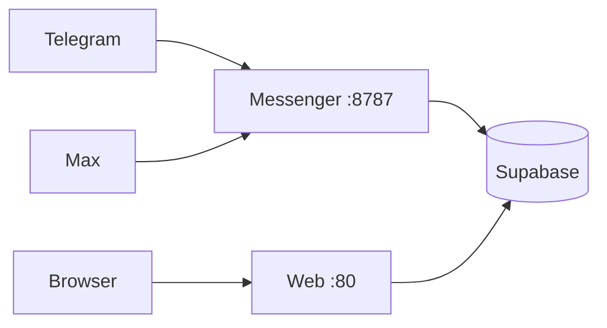

# Деплой на Dokploy

Рекомендуемая схема: **два отдельных Application** в Dokploy.

| Приложение | Dockerfile | Порт | Домен (пример) |
|------------|------------|------|----------------|
| Web (SPA) | `Dockerfile` | `80` | `https://app.example.com` |
| Messenger (webhooks) | `Dockerfile.messenger` | `8787` | `https://hooks.example.com` |

Не связывайте web с hostname `messenger` через nginx, если messenger — отдельное приложение. У web **не задавайте** `MESSENGER_UPSTREAM`.



---

## 0. Перед деплоем

1. Примените все миграции из `supabase/migrations/` к Supabase.
2. В Supabase → Authentication → URL Configuration:
   - **Site URL** = `https://app.example.com`
   - **Redirect URLs** = `https://app.example.com/**`
3. Закоммитьте и запушьте актуальный код (иначе Dokploy соберёт старый образ).

---

## 1. Application: Web

1. **New Application** → Git-репозиторий.
2. Build type: **Dockerfile**, path: `Dockerfile`.
3. Port: **80**.
4. Domain: `app.example.com` → HTTPS (Let's Encrypt / Traefik).
5. **Environment** (runtime, не Build Args):

```env
VITE_SUPABASE_URL=https://xxx.supabase.co
VITE_SUPABASE_ANON_KEY=eyJ...
VITE_APP_URL=https://app.example.com
VITE_TELEGRAM_BOT_URL=https://t.me/YourBot
VITE_MAX_BOT_URL=https://max.ru/YourBot
VITE_MESSENGER_API_URL=https://messenger.example.com
```

6. **Не добавляйте** `MESSENGER_UPSTREAM`.
7. Deploy → дождитесь **Rebuild**, не только Restart.

Проверка:

- `https://app.example.com/env.js` — реальные URL, не `${VITE_...}`
- отправка сообщения из админки идёт на `VITE_MESSENGER_API_URL/v1/outbound`
- В логах старта: `MESSENGER_UPSTREAM empty — /webhooks/ proxy disabled`
- Открываются `/admin`, `/cabinet`

---

## 2. Application: Messenger

1. **New Application** → тот же Git-репозиторий.
2. Build type: **Dockerfile**, path: `Dockerfile.messenger`.
3. Port: **8787**.
4. Domain: `hooks.example.com` → HTTPS (обязательно публичный HTTPS).
5. **Environment**:

```env
SUPABASE_URL=https://xxx.supabase.co
SUPABASE_SERVICE_ROLE_KEY=eyJ...service_role...
TELEGRAM_BOT_TOKEN=123456:ABC...
TELEGRAM_WEBHOOK_SECRET=случайная_строка_AZaz09_
MAX_BOT_TOKEN=токен_без_Bearer
MAX_WEBHOOK_SECRET=случайная_строка_AZaz09_
PUBLIC_WEBHOOK_BASE_URL=https://hooks.example.com
PORT=8787
LOG_LEVEL=info
```

Важно:

- `PUBLIC_WEBHOOK_BASE_URL` — только origin (`https://hooks.example.com`), **без** `/webhooks/telegram`.
- Max: токен **без** префикса `Bearer`.
- Секреты webhook: только `A-Z a-z 0-9 _ -` (5–256 символов).
- `SUPABASE_SERVICE_ROLE_KEY` — только в messenger, не в web.

6. Deploy.

Проверка логов messenger:

```text
[messenger] HTTP listening on :8787
[messenger] Webhook base URL {"url":"https://hooks.example.com"}
[messenger] Telegram webhook registered {"url":"https://hooks.example.com/webhooks/telegram"}
[messenger] Max webhook registered {"url":"https://hooks.example.com/webhooks/max"}
[messenger] Messenger worker ready
```

Проверка снаружи:

```bash
curl -sS https://hooks.example.com/health
# {"ok":true}
```

Если Max пишет `fetch failed` (TLS / сертификат Минцифры), временно:

```env
MAX_TLS_INSECURE=1
```

---

## 3. Email-уведомления (smtp.bz)

1. Задеплойте Edge Function `send-notification-email`.
2. Задайте secrets функции:

```env
SMTPBZ_API_KEY=ключ_из_кабинета_smtp.bz
SMTP_FROM=noreply@your-domain.example
SMTP_FROM_NAME=АПСС «Северное сияние»
APP_URL=https://app.example.com
EMAIL_WEBHOOK_SECRET=случайная_длинная_строка
```

3. После миграции `000046` укажите webhook в БД:

```sql
update public.app_settings
set value = 'https://YOUR.supabase.co/functions/v1/send-notification-email'
where key = 'notification_email_webhook_url';

update public.app_settings
set value = 'тот_же_EMAIL_WEBHOOK_SECRET'
where key = 'notification_email_webhook_secret';
```

Пока URL пустой, in-app уведомления работают, письма не отправляются.

---

## 4. После старта ботов

1. Добавьте бота АПСС в канал / группу / напишите ему в ЛС (Telegram или Max).
2. В админке: **Группы → [группа] → Чаты** — выберите чат из списка.
3. Сообщения появятся в ленте / кабинете **Сообщения**.

Подробнее: [MESSENGER_CHAT_IDS.md](./MESSENGER_CHAT_IDS.md).

---

## 5. Альтернатива: один Compose-стек

Можно задеплоить `docker-compose.yml` как Compose-приложение (web + messenger в одной сети).

Тогда:

```env
# web
MESSENGER_UPSTREAM=http://messenger:8787
VITE_APP_URL=https://app.example.com
VITE_TELEGRAM_BOT_URL=https://t.me/YourBot
VITE_MAX_BOT_URL=https://max.ru/YourBot
VITE_MESSENGER_API_URL=https://messenger.example.com

# messenger
PUBLIC_WEBHOOK_BASE_URL=https://messenger.example.com
```

Web nginx проксирует `/webhooks/` → messenger. Домен у web один; у messenger отдельный публичный домен не обязателен.

Для Dokploy проще и надёжнее **два отдельных Application** (разделы 1–2). Для отправки сообщений из админки задайте **`VITE_MESSENGER_API_URL`** на HTTPS-домен messenger.

---

## 6. Частые проблемы

| Симптом | Что делать |
|---------|------------|
| `host not found in upstream "messenger"` | Старый образ web **или** задан `MESSENGER_UPSTREAM` без сервиса messenger. Уберите env, сделайте **Rebuild** |
| Telegram: `HTTPS URL must be provided` | `PUBLIC_WEBHOOK_BASE_URL` должен быть `https://...`, не `http://` и не localhost |
| Max: `Malformed access token` | Токен без `Bearer `, актуальный из кабинета Max |
| Max: `fetch failed` | TLS; `MAX_TLS_INSECURE=1` или корневой CA Минцифры |
| Чаты не в picker | Messenger не запущен / бот не в чате / webhook не зарегистрирован |
| `/env.js` с `${VITE_...}` | Нет runtime `VITE_*` в Environment Dokploy |
